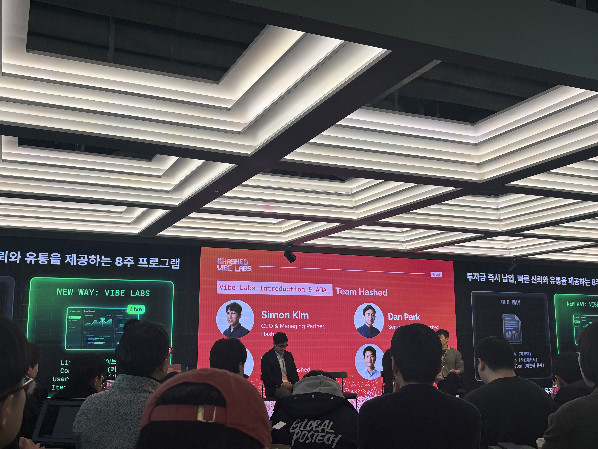
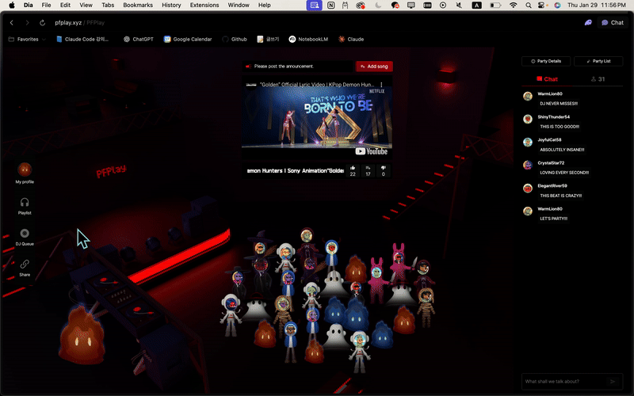
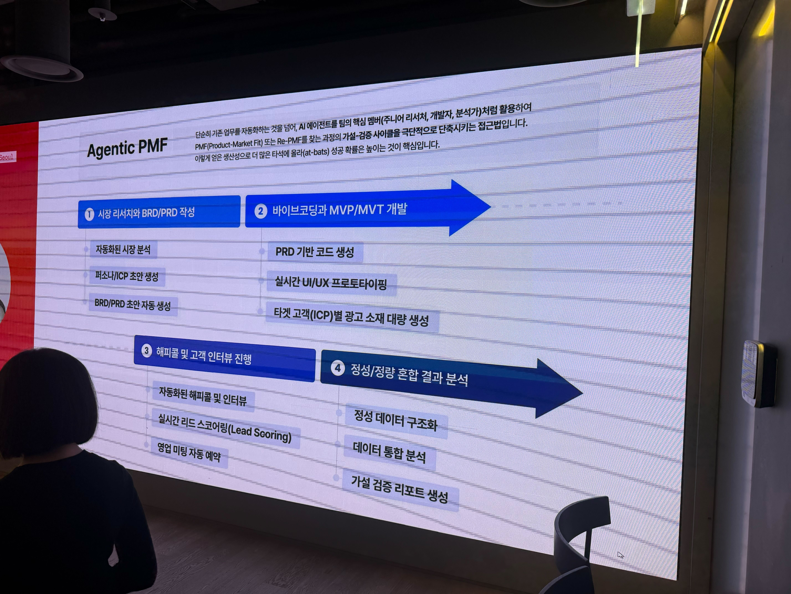
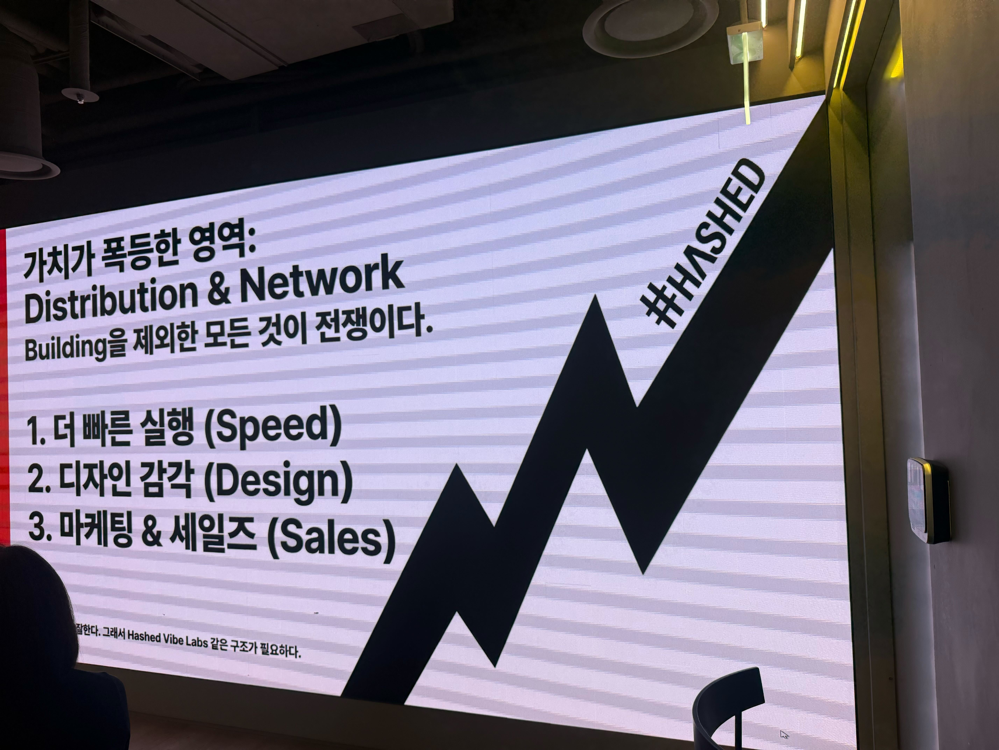
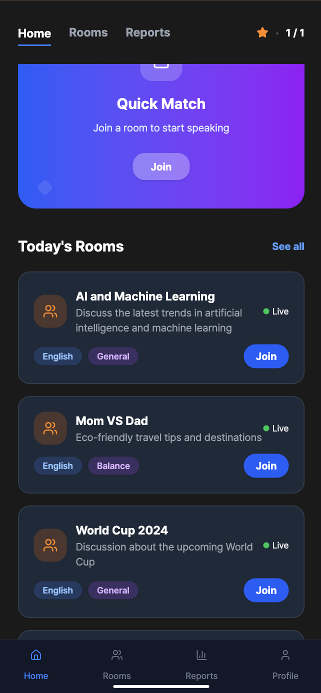

## 세상은 바뀌고 있구나

오전 반차를 쓰고 [Hashed Vibe Labs Seoul](https://luma.com/x4yml1a1)에 다녀왔고, 오랜만에 느끼는 가슴 뜀과 여운에 다시 PC를 켰습니다 ㅎㅎ



행사장에는 타 개발 커뮤니티 나잇에서 봤던 분들, 같은 사이드 프로젝트 기획자분 등 눈빛 초롱초롱한 사람들로 가득했습니다.

개발 컨퍼런스는 자주 가봤지만, 처음으로 이런 사업/비즈니스/블록체인 밋업을 다녀왔는데요, 기술적인 무게감 대신 분위기는 유쾌했고, 사무실에 앉아 열심히 개발하던 잔잔한 일상과는 대비되는 열정 넘치는 세상을 보고 왔어요.

## 무엇을 위해 참여했는가

```
닮고 싶은 모습을 가진 사람들과 최소한의 교류를 해보자.
```

저는 올해 이런 목표가 있었어요.
블록체인 밋업에 맞게 재밌는 대화가 생기지 않을까 싶은 기대감에 작년 7월부터 참여한 기획자 2분 + 개발자 3분이서 진행한 사이드 프로젝트, [pfplay](https://pfplay.xyz/)를 들고 찾아갔어요.
_(서버 비용 부담으로 오후 4시~오전 2시까지만 접속 가능합니다 ㅠㅠ)_



버려지는 NFT를 활용해서,

- DJing을 통해 서로의 음악 취향을 공유하고
- 많은 공감을 받는 취향에 보상을 제공하는
- 블록체인 기반 음악 플랫폼입니다.

## 개발 컨퍼런스 vs 비즈니스 밋업

개발 컨퍼런스는 주로 특정 도메인에서 특정 기능 개발을 위해 사용되는 기술 & "이런 기술적 병목을 → 이렇게 해결/개선했다" 식의 내용이 주를 이루었고, 신기하고 재밌지만 제 피부에 와닿지 않는 경우가 많았어요.

사업적인 컨퍼런스에서는...운영과 관리 관점에서 **기술에 몰입한 개발자가 보지 못하는 세상의 흐름**을 다뤘습니다. 아래는 크게 기억에 남는 인사이트를 정리해보았습니다.

#### 운영 패러다임 전환

과거에는 Technology Risk와 Product Risk가 핵심.
기술이 되느냐, 제품이 되느냐가 성패를 갈랐다.
MVP 하나 만드는 데도 수개월이 걸렸고, 구현 자체가 경쟁력.

하지만 지금...
리스크의 중심은 Distribution Risk로 이동.
제품은 하루 만에도 따라잡히고, MVP는 극단적으로 말하면 비행기 안에서도 완성 가능하다.

그래서 경쟁의 축 역시,

```
무엇을 만들었는가 → 어떻게 시장에 던지고, 어떻게 반복하고, 어떻게 운영하는가
```

속도는 기본값, 진짜 차이는 운영 레시피.

```
* 에이전트 orchestration 방식
* 실험 → 학습 → 자동 반영 루프
* 조직 Knowledge Base 축적 방식
```

#### 실행 자동화 루프

AI 에이전트는 단순 자동화 도구가 아니라, 가설 → 실행 → 학습 → 다음 가설 사이클을 압축함.
e.g. 연사 내 "아웃바운드 세일즈 자동 루프" 예시

- 가설 수립
- AI 광고 카피 / 이미지 생성
- 자동 광고 집행
- 관심자 전화번호 수집
- AI 10초 내 세일즈 콜
- 인터뷰 트랜스크립트 요약
- 인사이트 도출 → 다음 가설 생성



개별 모델이 아니라, 일련의 과정이 자동으로 연결되도록, 병렬 에이전트 협업을 구현함.
결국 싱글 에이전트보다 멀티 에이전트 자율 협업 구조 설계 능력이 핵심 역량이 된다.

#### 가설 검증 중심의 실행 철학

B 기업의 CTO 분이 “코드를 보지 않는 습관”이라는 언급을 하셨음.
코드를 보면 → 개인 생산성은 2~3배 좋아질 수 있다.
하지만 → 10배, 100배는 어렵다.

진짜 스케일은

- 플래닝
- 테스트 설계
- 실험 자동화
  에서 나온다.

내 머릿속 가설은 대부분 틀리기 때문에 완벽한 제품은 없고, 그래서 중요한 건:

- 빨리 시장에 던지고
- 빨리 틀리고
- 빨리 학습하고
- 자동으로 다음 실험으로 넘어가는 구조

#### 조직 구조 변화

기획과 개발의 분리는 점점 의미가 약해진다.
메이커는 점점 Scene Director에 가까워진다.

Scene Director는

- 추상적 주제를
- 장면 단위로
- 고해상도 디테일로 풀어내는 사람

좋은 메이커도 동일하다.

사용자 경험의 장면을 얼마나 세밀하게 상상하고
그것을 얼마나 빠르게 구현 실험하고
그것을 얼마나 데이터로 검증하는가
이 능력이 점점 더 중요해진다.

#### 작은 그룹이 임팩트를 만드는 이유

네트워킹 세션에서 교류한 대부분의 팀의 특징이다.
임팩트를 내는 팀은 대부분 소수 그룹이다.

- 의사결정 속도
- 실행 속도
- 학습 루프 속도
- 맥락 공유 밀도

AI 에이전트가 들어오면 소수 팀의 레버리지는 더 커진다.

e.g.

- Claude 작업 로그 자동 공유: 누가 무엇을 실험 중인지 자동 추적
- 팀 단위 학습 자동 축적 → 개인 능력보다 팀 collective intelligence가 해자가 된다.

#### AI 시대의 진짜 해자 (Moat)

속도는 이제 해자가 아니다.
누군가는 항상 더 빨리 만든다.

진짜 해자는 세 가지다.

1. 고객 관계 (AAR, 신뢰)
2. 에이전트 운영 레시피
3. Knowledge Base 축적

개인이 아니라 시스템이 기억하고, 조직이 학습하는 구조

여기에 더해
brand + trust + network 도 중요해진다.



#### Domain → Product 변환하는 개인 경쟁력

앞으로 중요한 사람은
“도메인을 많이 아는 사람”이 아니라
도메인 Sharpness를 Product로 변환하는 사람이다.

- 도메인 Insight → Feature
- Feature → Experiment
- Experiment → 자동 운영 루프

이 변환 속도가 곧 경쟁력이다.

## 글을 마무리하며

개발자로서 고수하는 제 입장은...

- 개발자들은 자신이 병목이 되지 않기 위해 여러 실험을 하고 있습니다
- MVP 는 진짜 빠르게 만들 수 있지만, 서비스 규모에 따른 설계 (코드, 인프라)와 서비스 안정성 (Downtime, Bug fix) 관점에서는 지식과 경험이 필요합니다.
- 1의 비용과 10의 가능성, 5의 비용과 5의 가능성, 이 비용간의 결정은 여전히 사람이 판단해야합니다.
- AI가 보지 못하는 엣지케이스를 찾는 혜안이 필요하고 경험이 필요합니다.
- 결과의 책임은 인간이 지고, 그러기 위해선 이해하지 못하는게 쌓이지 않도록 경계합니다.

하지만 스타트업씬에서는 관심사가 다를 수 있습니다,

- 초반에 속도는 빠르지만, 기능 추가에 따라 더뎌지는 구조와 초반에는 느리지만, 기능 추가가 빨라지는 구조에서 우리는 평생 고민할 것이라 생각합니다.
- 책임 소재 파악과 + 모르는게 쌓여감으로써 잃는 것보다 빠른 스피드로 정부와 규제로부터의 해자를 만들 수 있는 이득이 더 큰 것 같아요.

내 생각을 거스르는 시대의 흐름을 얼마나 열린 마음으로 받아들이느냐가, 결국 팀과 제품이 스케일업할 기회를 열고 닫는다는 걸 느낀 하루였습니다. 왜 그런 생각에 도달했는지 돌아보면, 빠르게 움직이는 플레이어들이 이미 그 답을 보여주고 있었기 때문인 것 같아요. 그래서 비즈니스와 세상의 흐름을 이해하는 플레이어로 계속 남아 있어야겠다는 생각으로 하루를 마무리하려합니다. 밋업을 준비해주신 관계자분들, 좋은 인사이트를 공유해주신 연사자분들께 감사드립니다.



저는 기존 언어교환의 지루한 스몰톡을 넘어서 더 몰입감 있고, 실제로 효과적인 연습을 할 수 있게 돕는 게임형 언어 교환 서비스 BeAS를 만들고 있어요.
빠른 시간 내 테스트 할 것이고, 지켜봐주세요. 씨유쑨!
