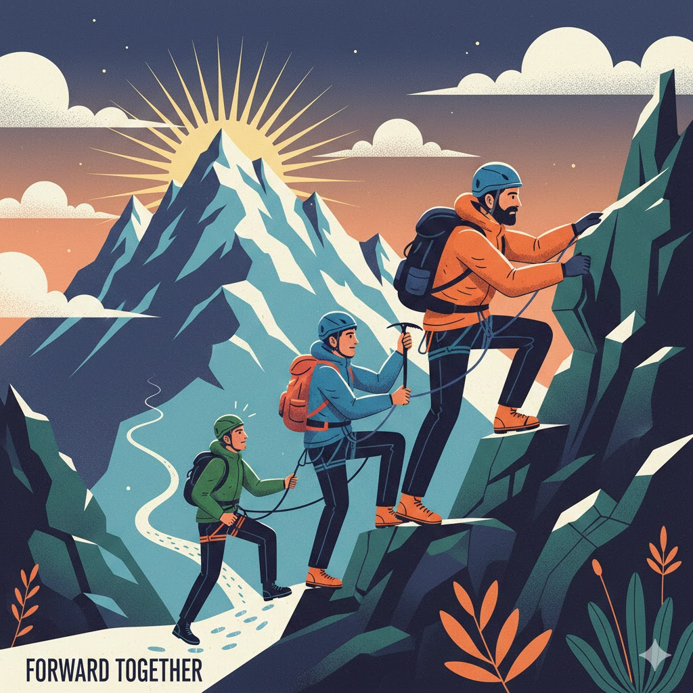
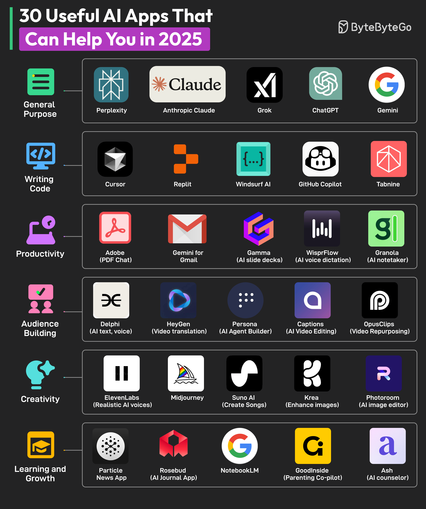
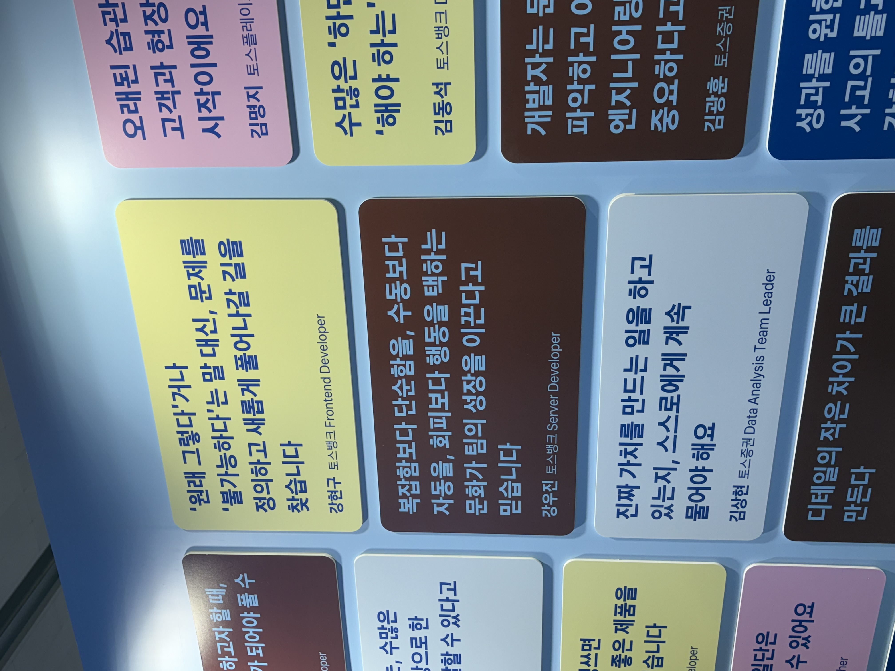
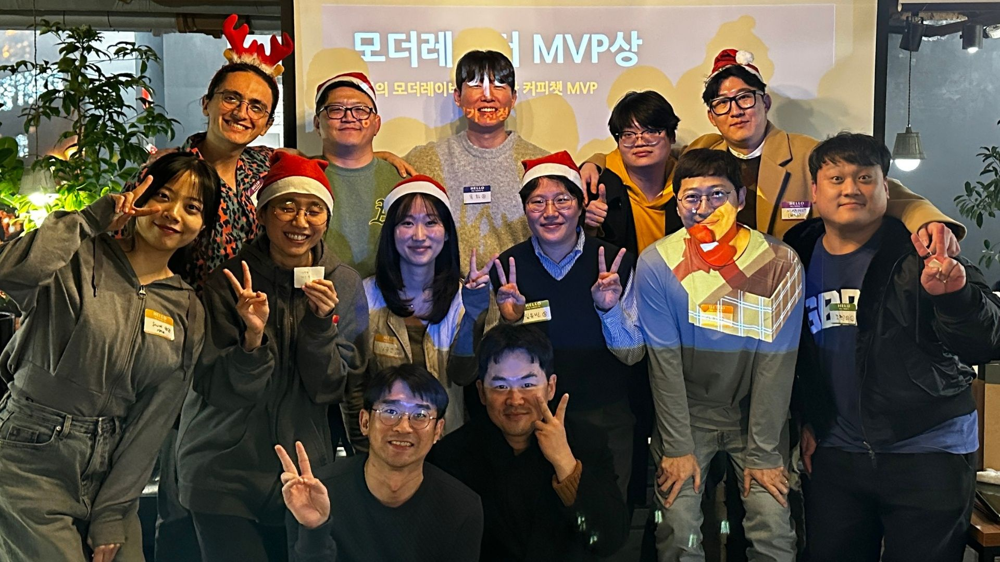
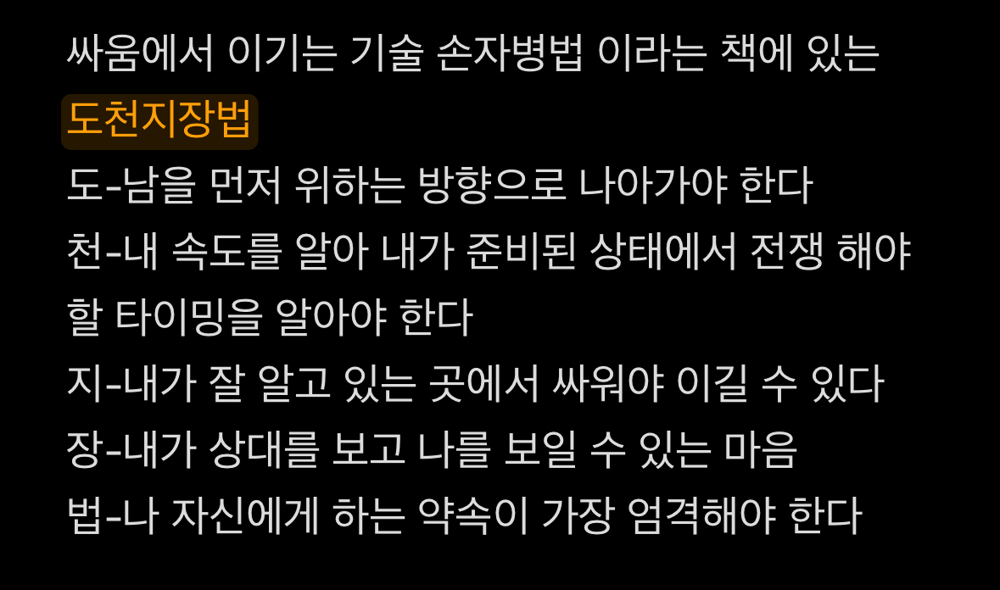

## 👋 안녕하세요,

벌써 2026년이 4일이 지났네요, 작년의 감사 인사와 회고에 쉴 틈 없이 바쁘진 않으셨을지 모르겠어요. <br>
일상에선 현재와 미래를 보며 살지만, 과거를 돌아보는 시간은 연말이 아니면 도통 결심이 서지 않더라구요.<br>
아마 연이어 글이 올릴 테지만, 이번 글이 이 블로그의 첫 글이 될 겁니다!<br>
저의 한해를 돌아보며, 독자분들도 저와 같은 상황을 고민하셨을지, 어떤 공식으로 풀어가셨는지 궁금하네요.<br>
이 포스팅은 저의 1년을 되돌아보고 새해 다짐을 세워보는 글이 될 것 같아요.

## 3년 차는 뭔가 달라야 하는 거 아닙니까? (실적 높은 팀으로의 당찬 이동...)

### 떠났습니다...

이전에는 결재 및 인사 시스템 / 사내 마케팅 인터널 제품을 개발했었어요.
프론트, DB, 백엔드, 인프라 등 관여할 수 있는 범위는 넓었지만, 사용자는 사내 한정 400명 남짓으로 사용자 풀이 적었고, 개선을 제안해도 그 의미가 흐릿하게 받아지는 환경 속 동기 부여되는 환경을 찾아 제품 개발팀으로 이동하게 됩니다.



### 도착한 곳이 낙원일까?...

사내 시스템 및 인터널 제품 개발을 하다 올해 사내 가장 실적이 높은 팀으로 이동해 나름 본부 내 가장 잘 팔리는,<br>
(1) 모의 피싱 훈련 및 교육 서비스<br>
(2) 문서 보안 및 권한 관리 Outlook 클라이언트 애드인<br>
제품을 개발했어요.

"분기 업데이트"란 저희 팀에서만 쓰는 말인데요, 작업 단위를 분기별로 릴리즈하는 문화입니다.<br>
2달 주기로 총 6번의 QA가 있었고, 디자인 시스템으로 마이그레이션 및 신규 서비스 구축이라는 2번의 메이저와 4번의 마이너 업데이트가 있었구요, 그 사이 제품 사양 파악을 위한 공부와 교육 (암호화, 클라우드) 교육이 있었답니다.


제품 설치 환경이 다양해요. 온프레미스, AWS, OCI...많은 고객사가 멀티테넌시로 제공되어 서버 구성도 복잡하고, 보안 제품 특성 상 서버 보안 모듈, 권한 관리 체계도 매우 복잡합니다. <br>

아무리 웹 복잡성이 늘어나고 프론트가 담당하는 비즈니스, 도메인 로직 범위가 커졌다고 해도, 데이터 설계나 코어 암호화 및 인증 기능은 백엔드에서 들고 있고, 프론트엔드는 상대적으로 수동적인 데이터 흐름을 따라가고 있다는 생각이 들더라구요.<br>
동시에 AI가 발전함에 따라서 나라고 특출나게 잘한다... 일을 잘한다는 체감이 잘 들지 않고, 성취감이 많이 줄어든 것 같아요.

우연이 보게된 APR 대표님이 발표하신 [성공 공식 영상](<(https://www.youtube.com/watch?v=q_NgaXK0l6c)>) 중 이런 내용이 있었습니다.

```
인정하자. 인생은 불안과 불신의 게임이다.
모두가 나를 불신하는 순간이 오고, 그럼에도 나는 나를 맹신하자.
상황을 타개하기 위해 나는 어떤 시도를 해 나아가야 하지?에 집중하자.
```

오랫동안 동기 부여가 안 된 상태로 있었는데, 그럼에도 내가 할 것은 무엇인가 집중 시켜주는 강연이었어요.<br>
저는 이제 이런 고민을 하게 됩니다.


```
나의 역할은? 나를 어떻게 포지셔닝할까?
```

### 나의 역할은 무엇일까...

나는 일당백을 하고 싶다...<br>
나의 영향 범위를 넓혀야 한다는 결론을 내렸어요.

#### (1) 서버 운영

신규 서버 운영이 필요한 상황이 왔고, 하겠다고 말씀드렸어요. 이전 팀에선 Asp + MSSQL 백엔드 개발, 윈도우 IIS 서버 운영 경험이 있었거든요, 이때의 경험을 살려 AWS 환경에서 고객사 애드인 지원을 위한 Node.js 서버를 구성하고 운영을 맡았어요. 인프런에서 AWS 입문 / 실전 강의를 들었고, 사이드프로젝트에서 NextJS가 배포된 GCP 서버 운영도 했어요.

#### (2) 사내 개발 환경 개선

이제 기능 개발이 조금은 단순 반복의 영역으로 들어온 것 같다는 느낌을 받았어요.
AI 도구로 개인의 생산성은 많이 올랐는데, 모든 팀원이 생산성을 높이기 위해선 팀 개발 환경 개선을 위한 툴과 문화를 개발해야하지 않을까 하는 고민을 했어요.

- 사내 디자인 시스템 / 팀에서 관리하는 제품의 프론트엔드의 CI/CD를 위한 Jenkins 파이프라인을 신규 구성했어요.
- 레거시 프로젝트에 nextjs standalone 배포 방식 적용, 코드 스플리팅, 동적 import, 컴파일러 규칙 정의를 통해 번들을 최적화 해 로딩 속도를 개선했어요.
- 여러 고객사에 지원될 여러 제품 애드인 지원을 위해 모노레포 구성을 했고, 복잡한 정책과 메일 서비스를 엔티티 단위로 구조화해 FSD 아키텍쳐를 적용했어요.
- 팀 코드 품질 개선을 위한 공용 컨벤션 에이전트용 문서를 만들었어요.

## 나는 재밌게 개발하고 싶어요 !! (하지만 불안해요...)



> 출처: bytebytego, _30 Useful AI Apps That Can Help You in 2025_ > https://bytebytego.com/guides/30-useful-ai-apps-that-can-help-you-in-2025/

올해는 격변의 시기였던 것 같아요. 새로운 AI 도구들의 등장 속도가 너무나도 빨라지고, 무언가를 하기 위한 비용도 우습게 저렴해지고. 최신 뉴스와 도구의 발전에 버거워하는 나 자신을 발견하게 됩니다.

고민의 히스토리...

```
-> (여러 개발 Agent 등장) 내가 하는 업무는 누구든 할 수 있겠다...

-> (무엇이 변하지 않을까?) 그럼에도 결국 변하지 않는 것은 서비스이기에, 나는 제품 사양을 빠르게 익히자!

-> (Spec 주도 개발 등장) 하지만 제품 사양도 결국엔 기록되고, 코드는 학습된다.

-> (병렬 에이전트) 좋은 도구를 줘도 왜 시간이 더 걸리지... 내가 병목이다...

-> (무엇이 중요할까?) 결국 중요한 것은 빠르고 쉽게 문제를 풀 수 있는 것...
```

### 그 고민끝 내린 나름의 결론(?)은...

문제를 잘 정의하고 / 복잡성을 구분 & 통제할 수 있는 기본 스킬을 키우자 였어요.<br>
회사 다니면서 트렌드를 모두 따라가긴 어렵기에, 알려주는 커뮤니티에 참여하거나 강의를 듣자, 그걸 적용해 볼 수 있는 사이드 프로젝트를 해 나만의 플레이그라운드를 만들자였어요.

### 그래서 나는 무엇을 했나?

- 디자인 패턴과 FDS 공부를 했어요.
- 우아한 타입스크립트, Clean Code 기본기를 다졌어요.
- 컨퍼런스(원티드 AX 컨퍼런스, 토스 Maker's 컨퍼런스)를 참석하고 소셜링을 했어요.
- 인프런 Claude Code 활용 강의, Cursor, react-router 7, supabase를 활용해 빠른 MVP를 만드는 Maker's master class를 수강했어요.
- PFPlay라는 NextJS, Tailwind CSS, FDS 등 최신 스텍의 사이드 프로젝트에 참여했어요.




### 결과물을 만들어!

작년 한 해를 돌아보며, 안타깝지만 보완해야 할 점이 보였어요.
한 것은 많지만, 결과물은?

```
결과물이 남는 노력을 하자.
```

올해는 이전까지의 고민과 노력을 결과로 정리하는 습관을 만들 거고, 기록하려고 해요.<br>
글을 읽어주시는 분들 실망시키지 않게 꾸준히 읽고 싶은 글로 찾아오겠습니다. 지켜봐 주세요.

## feat. 기억에 남는 경험들...

1. 나도 꾸준히 하는 게 있어야지<br>
   꽤 오랫동안 운동과 담을 쌓아왔지만, 작년엔 꾸준히 운동했어요.<br>
   봄엔 요가, 여름엔 수영, 가을엔 런닝과 두 번의 마라톤 참가 (기부런, 마블런 10KM ✌️), 겨울엔 헬스!
   몸이 불편한 걸 거슬러서 하는 운동이라는 작은 성취가, 갈등이나 힘든 상황에서도 탄력 있게 일어나게 도움 주는 태도를 만들어준다 체감할 수 있었어요.

2. 읽었던 책 속 기억에 남는 구절

- 어른의 행복은 조용하다:<br>
  마지막에 웃는 놈이 좋은 인생인 줄 알았다! 근데 자주 웃는 놈이 좋은 인생이었어.

- 고전이 답했다: 싸움에서 이기는 도천지장법!<br>
  

3.  소원이 정말 이루어진다면, 나는 어떤 걸 빌까?<br>
    템플스테이를 두 번 갔는데요, 108배도 하고 명상 방법도 배웠습니다 (강추). 이제 스님이 이런 말씀을 하셨어요. 진짜 기왓장에 소원을 적으면 진짜 이루어지기 때문에 조심히 써야 한다. 진짜 바라는 소원이 이루어진다고 했을 때 마지막에 생각나는 소원은 무엇일까, 생각했을 때 "복권 당첨되게 해주세요", "사업 대박 나게 해주세요" 처럼 욕심 많고 허상 된 말이 아닌, "사랑하는 사람들 뜻하는 일 다 잘되고 건강하고 행복하게 해주세요", "저도 제가 노력한 만큼 진실되게 삶을 살아갈 테니 뜻한 대로 이루어지게 도와주세요" 처럼 진정한 나와 남을 위하는 말이 나오더라구요.<br>
    여러분들도 꼭 이루어지는 소원이 있다면 무엇을 빌 건가요?

## 글을 마무리하며..

이전에도 블로그가 있었지만 (티스토리, 노션...), 블로그 호스팅하고 쓰는 첫 글이라 의미 있었으면 좋겠다는 욕심이 있었어요.<br>
일단 써보는 거지 뭐. 란 생각으로 쓰기 시작했어요.<br>
잘 써야지 하는 욕심으로 망설이는 분들이 있다면 당장 쓰시면 됩니다!<br>
글 작성에 도움 된 글이에요 [여기](https://wormwlrm.github.io/2022/08/20/Personal-Branding-from-Technical-Writing.html). 저도 저만의 글 작성 프로세스를 만들어보려구요!<br>
다음에는 더 읽기 쉽고 재밌는 글로 돌아오겠습니다. 사요나라!
