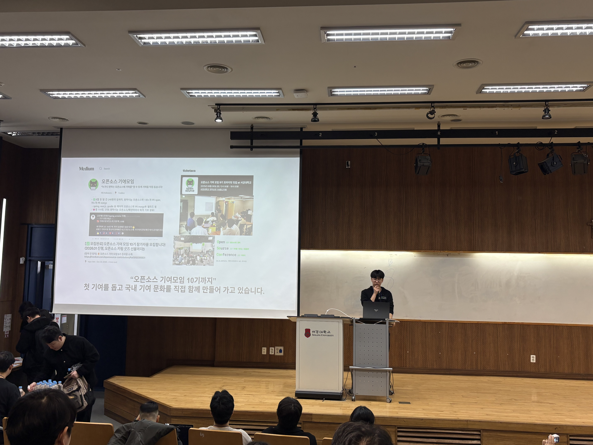
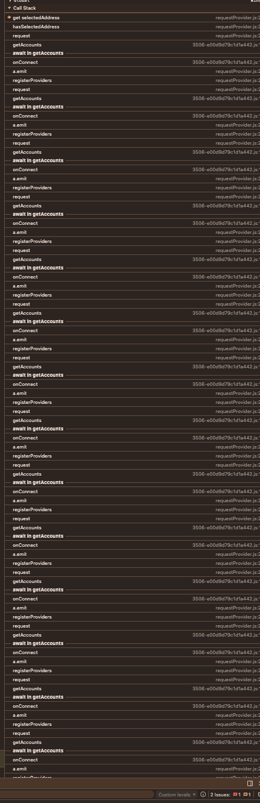
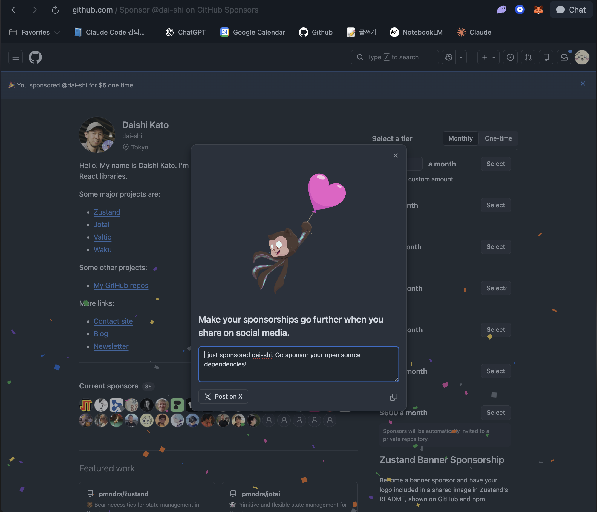
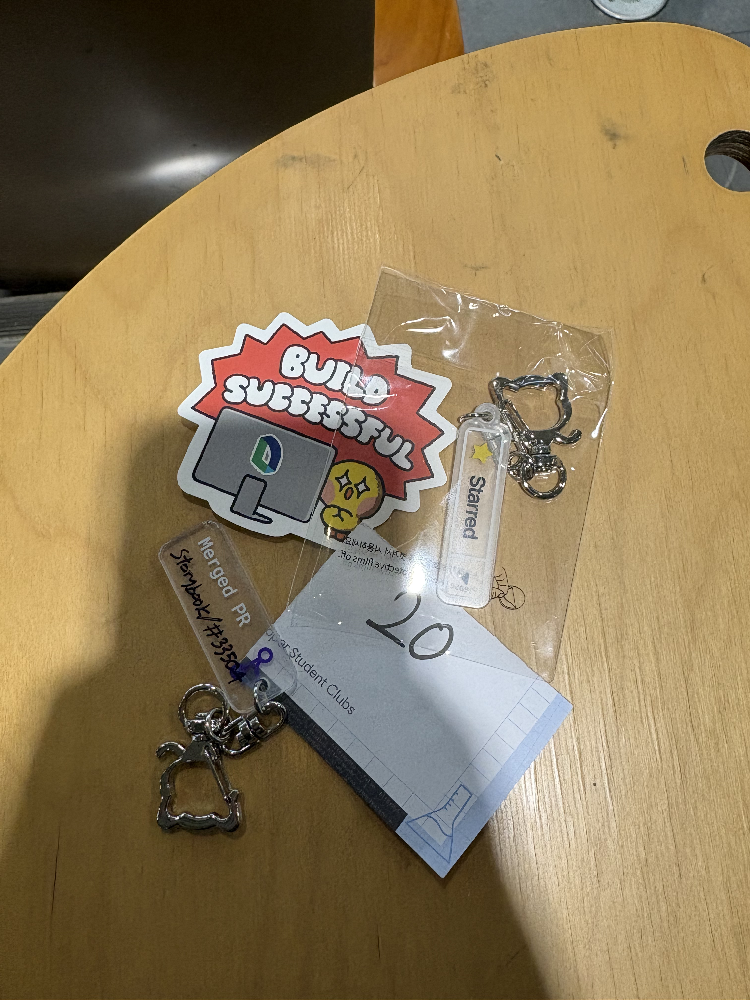

## 시작

오픈소스 기여 모임을 통해 오픈 소스 기여에 처음 동참하게 되었습니다. 
아주 작은 기여였지만 그 기여 과정와 밋업에서의 교류를 통해 얻은 경험적인 내용을 공유하려고 합니다. <br>
AI에 위임하는 오픈 소스 기여에 대한 비판은 많지만, 활용을 통해 개발 접근성을 높이고 창작을 가속화하는 흐름은 편승하기에 충분히 유의미한 것 같습니다. <br> 
실제 기여 과정을 통해, 코드 수정보단 실제로 문제 재현 & 맥락을 이해시키기 위한 설명 능력이 주안임을 깨달았고, 그 외 깨달은 점 및 AI를 어떻게 작업 흐름에 융합시켰는지를 기록하고자 합니다. 



## 이슈 선정 과정

이슈 선정에 있어선 다음 기준을 두고 골랐습니다. 

- 내가 잘 쓰는 기술 / 혹은 관심사와 연결되는지
- 공부하며 파고들 수 있는 이슈인지
- 메인테이너 반응 속도(댓글/리뷰 루프)가 충분히 빠른지 
- 외부 PR 수용성이 확보된 프로젝트인지

이 기준으로 후보를 보니 대략 이런 경향이 나왔어요. <br>
storybook, typescript-eslint 같은 프로젝트는 기여 속도와 피드백 속도가 빨랐고, shadcn/ui나 단일 유지보수형 프로젝트는 리뷰 병목이 컸어요. <br>
단순히 재미를 넘어서 지속 가능한 협업이 될 수 있는지를 고려했고, 결국 활발한 storybook과, Web3 지갑 연결을 위해 사이드 프로젝트에서 사용 중이면서 재현되는 이슈를 포함한 rainbbowkit 라이브러리를 선정하게 되었습니다. 

## 준비 

이슈를 고른 뒤엔 실제 난이도가 붙기 전에, 먼저 커뮤니케이션의 뼈대를 만들었어요. 오픈소스에서 진행 속도가 늦는 건 구현 난이도보다 전달 비용이 클 때가 많았거든요.

- PR 설명을 꼭 넣기: Motivation, Expected Outcome, 체크한 테스트
- 리뷰어 태그와 리뷰 요청 순서를 의도적으로 고정하기
- 코멘트 범위를 짧게, 가정은 명확하게 적기

특히 triage 구간에서 실험적으로 반복한 질문은 이거였어요.

- 이슈에 `need triage`가 붙어 있어도 제가 먼저 착수해도 되는가
- “재현은 확인했고, 가설 근거도 남겼는데 수정 진행해도 될까요?”를 어떤 형태로 남기면 될까

처음엔 행정처럼 느껴졌지만, 사실 이 단계가 PR 피드백 시간을 가장 많이 단축해줬습니다.

## AI 기여 파이프라인을 만들자

기여 자체보다 더 신경 쓴 건, AI를 어떻게 썼는지였어요.  
제가 쓴 건 claude code였고, 이슈 선정 - 재현 여부 파악 - 답 유도 - 컨벤션 병합된 pr 작성 흐름까지 자동화하는 루틴이 핵심이었습니다. 

### 1) 프로젝트 후보 분석: 기여 난이도 + 적합도 점수 만들기

처음 후보를 골라낼 때 AI에게 아래 항목으로 계산하게 했어요.

- 기여 난이도
- 내 스택 적합도(JavaScript/React/Vite 생태계와 거리)
- 메인테이너 리뷰 루프 가능성
- 외부 PR 수용성(토론 속도, 피드백 문화)

AI가 만든 후보를 기준으로 최종 선정을 했고, 그 기준은 결국 제 판단이었어요.
- storybook: 높은 복잡도지만 학습성과 영향도가 큼
- rainbowkit: 구현 자체보다 이벤트/동시성 디버깅 연습치가 큼
- 결국 “내가 한 번에 얻는 리턴(학습+재사용성)”이 가장 높은 항목을 선택

### 2) 기여용 스킬을 AI로 고정한 방식

이후엔 구현 전에 쓰는 스킬을 고정했습니다.

- github cli로 이슈 문맥을 스스로 파악시킨다 
- Chrome DevTools 재현 스킬: 스택, 이벤트, 렌더 경로를 빠르게 분해
- Playwright / vitest 기반 TDD 재현 스킬: 실패 재현 → 축소 → 재실행 사이클을 자동화
- 정답을 직접 안 주고 질문으로 유도하는 `핑퐁` 스킬: 내가 최종 결론을 선택하게 구성
  (*연사분이 공유주신 작업 스킬입니다 😊)
- `contributing-guide.md`, `developer-guide.md` 기반, `보안` 검증 스킬: 공식 문서를 기준으로 누락/범위를 먼저 걸러냄

구현 전에 필요한 증거를 먼저 정렬할 수 있었고, 실험 횟수와 되돌림이 상당히 줄어들었습니다. 

## Storybook 이슈 33433: hoisting 가정이 만든 경로 깨짐

PR 링크: [storybook#33433](https://github.com/storybookjs/storybook/issues/33433)

핵심 증상은 .ejs 파일을 수정할 때 pre-commit이 실패하는 문제였습니다.
재현 자체는 어렵지 않았지만, 사용자가 직접 체감하는 표면 이슈는 아니라서 분석의 시작점을 잡기가 조금 애매했습니다.

문제의 설정은 아래와 같았습니다.

```json
"*.ejs": ["../scripts/node_modules/.bin/ejslint"]
```

의존성 실행 경로를 상대 경로로 고정해 둔 상태였습니다.

하지만 모노레포에서 Yarn 4를 사용하는 환경은 의존성 배치 방식이 로컬 환경마다 달라질 수 있습니다.
그래서 실제 바이너리 위치가 환경마다 어긋날 가능성이 있었고, 그 결과 같은 코드에서도 pre-commit이 실패하기도 했습니다.

그래서 실행 경로를 고정하지 않고, Yarn 실행 컨텍스트에 맡기는 방식으로 수정했습니다.

```json
"*.ejs": ["yarn --cwd ../scripts ejslint"]
```
이 PR은 Storybook 코어 기능에 기여했다기 보단, 실행 환경에 대한 가정을 제거하는 작업에 가까웠습니다.
결과적으로 개발자 경험이 더 좋아졌다는 점에서 첫 기여로 뿌듯했던 기억이 있습니다. 

## RainbowKit PR 2625: 멀티 브라우저 익스텐션 호환성

PR 링크: [rainbowkit#2625](https://github.com/rainbow-me/rainbowkit/pull/2625)

이 이슈는 MetaMask, Phantom, Coinbase 지갑이 동시에 설치된 환경에서
특정 시점에 UI가 멈춘다는 리포트에서 시작됐습니다.

사용자 기준 증상은 단순했습니다.
Stop을 눌러도 반응이 없다
DevTools 정리가 늦어진다
하지만 내부 흐름을 따라가다 보니 호출 경로가 이렇게 이어지고 있었습니다.



```text
getAccounts → registerProviders → onConnect → getAccounts
```

여기서 중요한 점은 window.ethereum을 여러 확장 프로그램이 동시에 주입한다는 것입니다.

provider의 주도권이 계속 바뀌면서
onConnect 계열 요청이 다시 호출되고, 결국 재진입 루프가 반복되는 구조였습니다.

특히 이 분기가 핵심이었습니다.

```tsx
createConnector: shouldUseWalletConnect
  ? getWalletConnectConnector({ ... })
  : getInjectedConnector({ flag: 'isZeal' })
```

getInjectedConnector는 초기 connector를 구성한 뒤
실행 시점에 Wagmi 흐름을 통해 provider를 감지합니다.

문제는 여러 connector가 동일한 provider 이벤트를 동시에 감시할 때였습니다.
같은 신호를 여러 곳에서 처리하면서 경합이 발생할 여지가 생겼습니다.

그래서 대응 방향은 다음 세 가지로 정리되었습니다.
- 조회 중복을 막는 가드 (isConnecting 같은 in-flight 상태 추적)
- 동일 상태 전환 이벤트 deduplicate
- provider 경합 지점에서 단일성 보장

사이드 프로젝트에서 실제 사용 중이었고, 브라우저 별 호환성 체크 과정에서 재현되던 critical 버그였습니다. 이벤트 흐름을 관찰하기 위한 디버깅 방식을 익힌 경험이었습니다. 

## 그래서 결국 남는 건 무엇일까

밋업 이후 계속 머릿속에 남은 질문이 하나 있었습니다.

```
AI를 써서 이슈 선정부터 해결까지 도움을 받는다면
결국 내게 남는 것은 무엇일까?
```
기여 과정에서 역할을 나눠보면 이렇게 정리할 수 있었습니다.

AI: 가설 후보 생성 + 탐색 속도 향상

나: 어떤 가설을 채택할지, 왜 그 결론이 팀에 도움이 되는지 판단

하지만 밋업에서 다른 연사들의 이야기를 들으면서
이 질문을 조금 다르게 보게 되었습니다.

직접 메인테이너가 되어 프로젝트 방향을 논의하거나,
가격 정책이나 지원 범위 같은 의사결정까지 깊게 관여하는 경험을 들으며
오픈소스 기여가 어디까지 이어질 수 있는지 보게 되었습니다.

돌아보니 제가 기여한 이슈들은 의미 있는 경험이었지만,
아직 프로젝트의 의사결정에 닿을 정도로 깊게 파고든 문제는 아니었습니다.

그래서 올해의 목표를 하나 정해보았습니다.

유수 오픈소스 프로젝트에서 메인테이너 활동에 가까운 기여를 해보는 것입니다.
단순히 PR을 보내는 것을 넘어서, 의사결정에 기여할 수 있는 기록을 남기는 방식으로
기여 습관을 바꿔보려 합니다.

```


결국 오픈소스에서 남는 것은 코드가 아니라 어떤 판단을 했는지에 대한 기록이다!
```

### 마무리 
큰 허들이라고 생각했는데 운영진 분들 덕에 오픈 소스 기여에 첫걸음 뗄 수 있었던 것 같습니다. 
이런 대가 없이 참여하는 문화가 오픈 소스 커뮤니티를 더 활발하게 만드는 것 같아 기여할 수 있어 뿌듯하고 자극되는 시간이었습니다. 좋은 인사이트 나누어주신 연사분들께 감사합니다 😊

